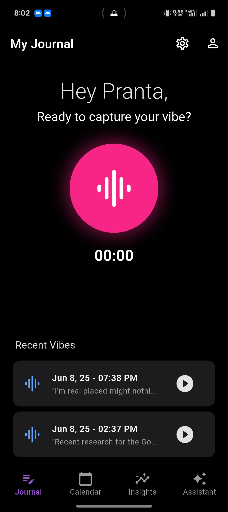
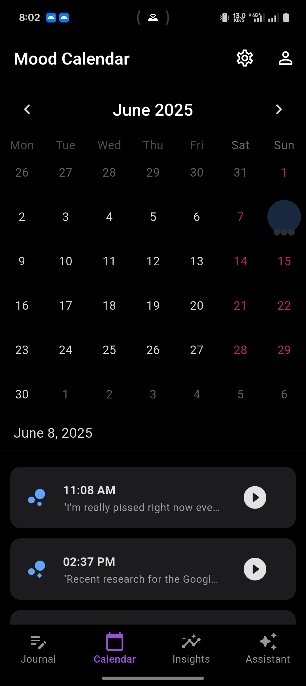
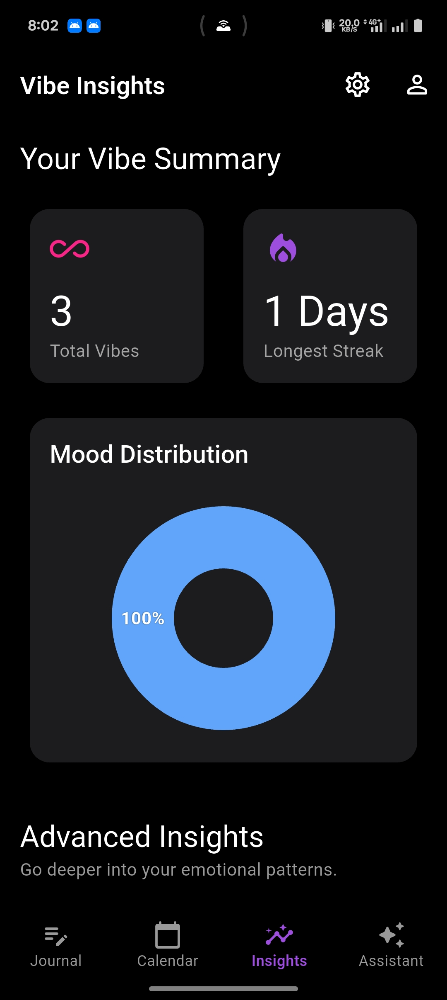
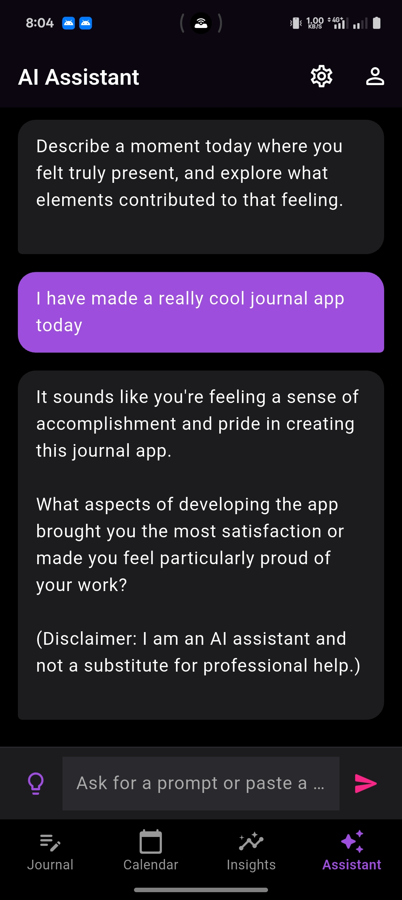
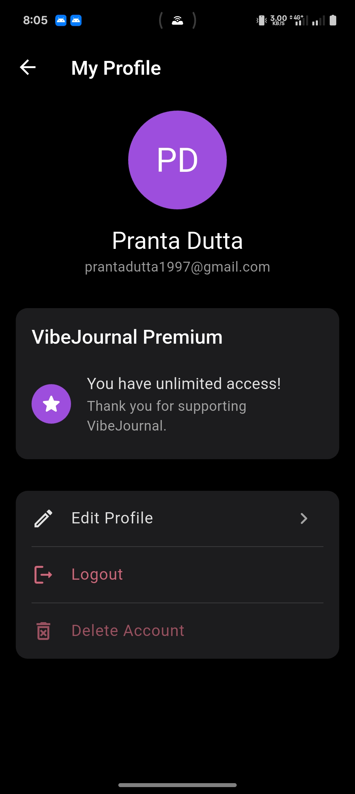
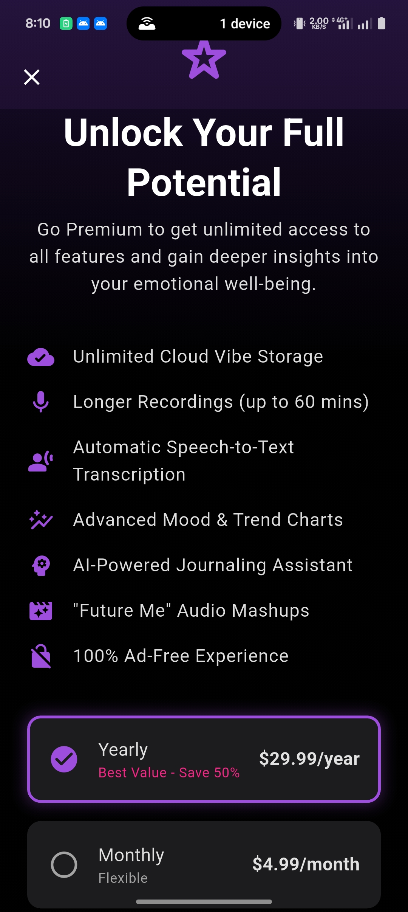

# 🎙️ VibeJournal - Your Daily Mood Podcast

VibeJournal is a modern, AI-powered personal audio journal designed to help you understand and reflect on your daily moods. Instead of typing, you simply talk. The app handles the rest, turning your voice entries into a structured, insightful journal that reveals trends and patterns in your emotional well-being over time.

---

## ✨ Screenshots

| Journal Screen                                        | Calendar "Mood Map"                                   | Insights Dashboard                                  |
| :---------------------------------------------------- | :---------------------------------------------------- | :-------------------------------------------------- |
|    |  |  |

| AI Assistant Chat                                               | User Profile                                             | Upgrade to Premium                                   |
| :-------------------------------------------------------------- | :------------------------------------------------------- | :--------------------------------------------------- |
|  |  |   |

---

## 🔥 Core Features

### Free Features (Available to All Users)
* **Audio Journaling:** Record daily audio entries to capture your thoughts and feelings. Free users can record vibes up to **5 minutes** long.
* **Automatic Analysis:** Each vibe is automatically processed on the backend to provide:
    * **Speech-to-Text:** A full transcription of your audio entry.
    * **Mood Detection:** An AI-generated mood (`positive`, `neutral`, `negative`) based on sentiment analysis.
* **Vibe History:** View your recent journal entries on the main screen. The free plan includes cloud storage for up to **75 vibes**.
* **Interactive Mood Calendar:** A beautiful calendar that visualizes your journaling journey. Each day is color-coded based on the dominant mood of your entries, creating a "mood map" over time.
* **Basic Insights:** See high-level statistics like your total number of vibes and your longest journaling streak.
* **Secure Accounts:** Full user authentication (signup, login) and the ability to manage or delete your account.

### 💎 Premium Features
* **Unlimited Cloud Storage:** Save an unlimited number of vibes to the cloud. Never lose an entry.
* **Longer Recordings:** Record detailed thoughts with a duration of up to **60 minutes** per vibe.
* **Advanced Insights:** Unlock powerful data visualizations:
    * **Mood Over Time Chart:** A line chart that plots your mood scores over weeks, months, or all time, revealing deep emotional trends.
    * **Emotional Intensity Chart:** See not just *if* you were positive or negative, but *how strongly* you felt those emotions.
* **AI Journaling Assistant:** Your personal, conversational journaling partner.
    * Get thoughtful, unique prompts when you don't know what to say.
    * Receive supportive, reflective feedback on your journal entries to deepen your self-understanding.
* **"Future Me" Playback:** Listen to an audio mashup of short clips from your vibes over the last month—a unique way to hear your journey.
* **Ad-Free Experience:** Enjoy VibeJournal without any interruptions.

---

## 👨‍💻 Tech Stack & Architecture

This project utilizes a modern Flutter front end with a powerful Firebase backend to handle data and advanced processing.

### **Frontend (Flutter)**
* **UI Framework:** Flutter 3.x
* **State Management:** `setState` combined with a `get_it` service locator for dependency injection.
* **Audio:**
    * **`flutter_sound`**: For reliable, cross-platform audio recording (`.wav` format) and playback.
* **UI & Utilities:**
    * **`table_calendar`**: For the interactive calendar view.
    * **`fl_chart`**: For creating beautiful, animated charts on the Insights screen.
    * **`haptic_feedback`**: For providing tactile feedback on user interactions.
    * **`shared_preferences`**: For storing simple local user preferences.

### **Backend (Firebase & Google Cloud)**
* **Authentication:** Firebase Authentication for secure email/password login.
* **Database:** Cloud Firestore for storing user data and vibe metadata (transcriptions, moods, etc.).
* **File Storage:** Firebase Storage for securely storing all user audio files.
* **Backend Logic:** Cloud Functions for Firebase (written in TypeScript) for all server-side processing.
    * **`analyzeVibe` Function:** An event-driven function that automatically triggers when a new audio file is saved. It uses Google Cloud APIs to process the audio.
    * **`aiAssistant` Function:** A callable function that connects the app to the Gemini API for providing prompts and feedback on demand.
* **AI & ML APIs:**
    * **Google Cloud Speech-to-Text API:** For generating transcriptions.
    * **Google Cloud Natural Language API:** For sentiment analysis to determine the mood.
    * **Google Vertex AI (Gemini 1.5 Pro):** To power the AI Journaling Assistant.

---

## 🚀 Getting Started

To get a local copy up and running, follow these simple steps.

### **Prerequisites**
* Flutter SDK installed.
* Node.js and npm installed.
* Firebase CLI installed (`npm install -g firebase-tools`).

### **Setup**
1.  **Firebase Project:**
    * Create a new project on the [Firebase Console](https://console.firebase.google.com/).
    * Upgrade your project to the **Blaze (Pay-as-you-go) Plan**. This is required for the Google Cloud APIs.
    * Enable **Authentication** (Email/Password), **Firestore**, and **Storage**.
    * Add an Android and/or iOS app to your Firebase project and place the respective configuration files (`google-services.json` & `GoogleService-Info.plist`) in your Flutter project.

2.  **Google Cloud APIs:**
    * In the [Google Cloud API Library](https://console.cloud.google.com/apis/library) for your project, enable the following APIs:
        * Cloud Speech-to-Text API
        * Cloud Natural Language API
        * Vertex AI API

3.  **Flutter App:**
    * Clone the repository: `git clone <repository_url>`
    * Navigate to the project folder: `cd vibe_journal`
    * Install dependencies: `flutter pub get`

4.  **Cloud Functions:**
    * Navigate to the functions directory: `cd functions`
    * Install npm dependencies: `npm install`
    * Deploy the functions: `firebase deploy --only functions`

5.  **Run the App:**
    * Navigate back to the root directory: `cd ..`
    * Run the app: `flutter run`

---